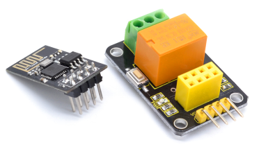
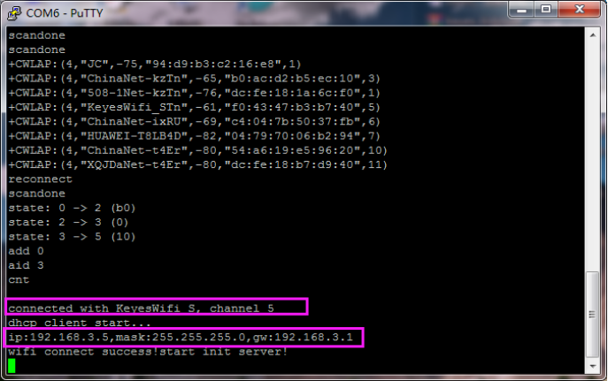
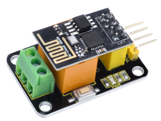
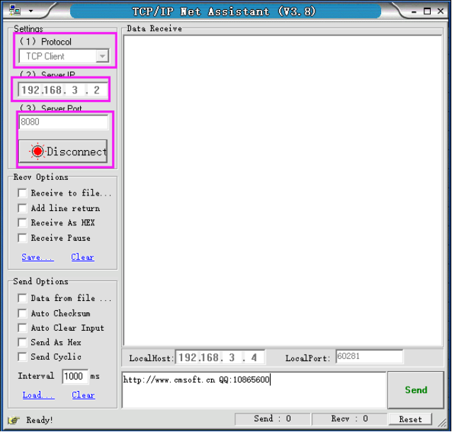
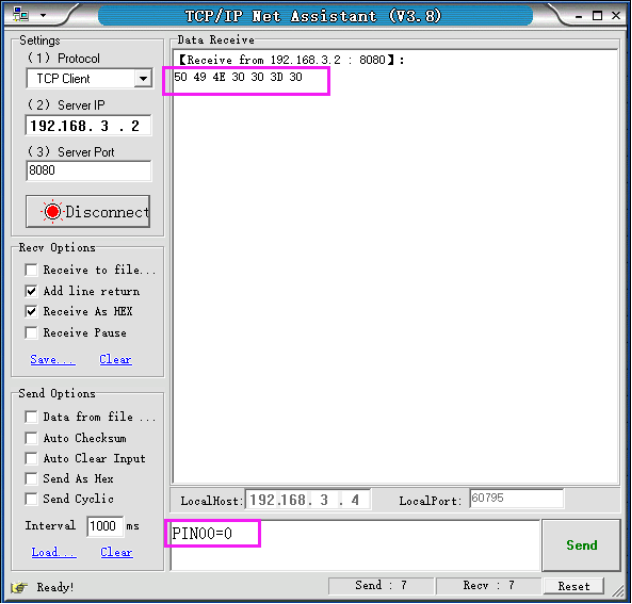
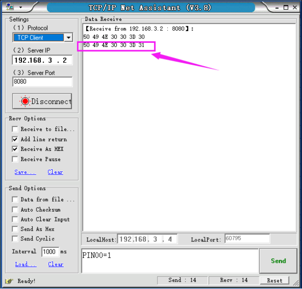
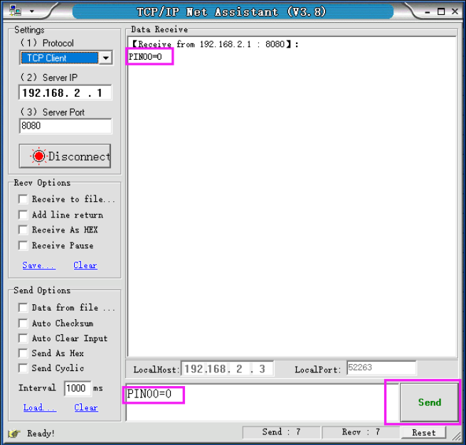
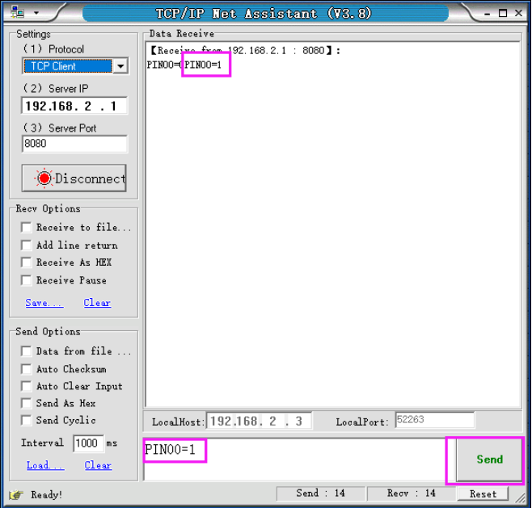

# KS0408 keyestudio ESP-01 Relay Module

Download Resources :  [Resources](./Resources.7z)


## 1. Description

Relays are one of the most commonly used components for setting the smart home when we are doing the Internet of Things.

For wireless control, we specially designed this relay module. The relay module is equipped with an ESP8266-01 Wifi module.

It can be connected to the wireless network, and then can send commands to the module in the remote or LAN host computer. After receiving the command, the module can close or open the relay.

For simple use, we provide our own compiled firmware, the firmware is server mode. The specific information are as follows:

- **Module working mode:**

```
work in mode:3
```

- **Softap mode:**

```
softAP SSID: KeyesWifi_A  ;  password: KeyesWifi   
softAP IP: 192.168.2.1    
softAP_server IP: 192.168.2.1   
```

- **Station mode:**

```
Station SSID: KeyesWifi_S  ;  password: KeyesWifi   
Station IP: automatic router assignment   
Station_server IP: Router automatically assigns port:8080 
```

## 2. Specifications

- Working voltage: DC 3V--3.3V
- Working current: >500MA
- Main control chip: ESP8266-01
- Relay model: HK4100F-DC3V-SHG
- Relay Specifications: 3A 250V AC/3A 30V DC
- Output terminal: 128-3.5 3P
- Button function: reset button

## 3. Packing Includes

- Keyestudio Relay module x 1
- ESP8266-01 Wifi module x 1



## 4. Use Methods

**1.Burn the Firmware**

We have already burned the firmware in the ESP8266-01 WIFI module. And you can re-burn the firmware by yourself as well.

The programming method is as follows:

**①**Plug the ESP8266 WIFI module onto the keyestudio USB to ESP-01S Wifi shield, and push the shield’s button to **Uart Download** end. Then can directly connect them to your computer’s USB port.


**②** Double click to open **FLASH_DOWNLOAD_TOOL**, as shown in the figure below, uploading the firmware.


You will see the interface window below.


Then open the ESP8266 Download Tool. For SPIDownload, open the corresponding file. As shown below.


After click to start download, the interface is as shown below.


**2.Station Mode Operation**

Because the station_server IP is automatically assigned by the router, so need to read the IP from the serial port. For example:

①Set the SSID of the home Wifi to: KeyesWifi_S and password is KeyesWifi  (note here should set your own home wifi)

②Directly connect the keyestudio USB to ESP-01S Wifi shield to your computer’s USB port. Then push the shield’s button to **Flash Boot** side.


**③** Open the PUTTY software on your computer. Below is the example figure we operate.


Double-click the icon of PUTTY software, pop up the interface window below.


After Click Open, plug the ESP8266 WIFI module into keyestudio USB to ESP-01S Wifi shield.

Note must click **Open** first, then plug the ESP8266 WIFI module into keyestudio USB to ESP-01S Wifi shield. Or else it is invalid.


**④** The PUTTY terminal will print the message showed below. IP read success!



From the figure, remember your IP name, here is **192.168.3.2**.

**⑤**The computer and the home wifi are in the same LAN, and the network segment is the same. Connect your computer to your home WiFi. For example, here we use: **SSID: KeyesWifi_S  ; Password: KeyesWifi**.

**⑥**Plug the ESP8266-01 module into the relay module and access to 3.3V power supply.



**⑦** Open the network debugging assistant software, as shown below.




**⑧**Send the signal **PIN00=0** to close the relay. Shown below.



 You will hear the tick sound of relay closed.

**⑨**Send the signal **PIN00=1** to open the relay. Shown below.



You will hear the tick sound of relay open.

For the Station mode operation, the test is finished!

**3.Softap Mode Operation**

**①**The computer and the home wifi are in the same LAN, and the network segment is the same. Change your home wifi name to avoid wifi module automatic connected.

**②**Connect your computer to your home WiFi. For example, here we use: **SSID: KeyesWifi_A  ; Password: KeyesWifi**.

**③**Plug the ESP8266-01 module into the relay module and access to 3.3V power supply and wait for 20 seconds.


**④**Open the network debugging assistant software, as shown below.


**⑤**Send the signal **PIN00=0** to close the relay. Shown below.



You will hear the tick sound of relay closed.

**⑥**Send the signal **PIN00=1** to open the relay. Shown below.



You will hear the tick sound of relay open.

For the Softap mode operation, the test is finished!